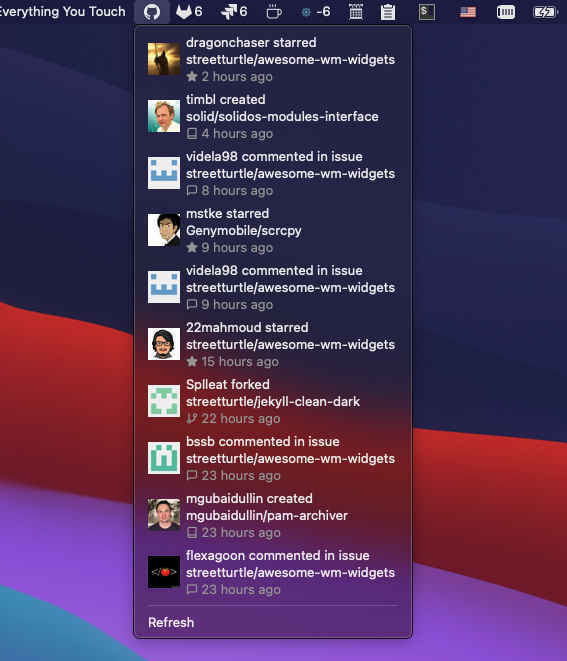

# GitHub Menu Bar App



Shows 10 latests events fot your github profile, similar to the event feed on github's landing page.

# Installation

 - download and install [Hammerspoon](https://github.com/Hammerspoon/hammerspoon/releases/latest)
 - download and install [GitLab Spoon]()
 - open ~/.hammerspoon/init.lua and add following snippet:

```lua
-- GitHub
hs.loadSpoon("github")
spoon.github:setup({
    username = 'streetturtle' -- your username goes here
})
spoon.github:start()
```

To generate a token, go to: https://gitlab.com/-/profile/personal_access_tokens, select **api** scope and type a name.

This app uses icons, to properly display them, install a [feather-font](https://github.com/AT-UI/feather-font) by [downloading](https://github.com/AT-UI/feather-font/raw/master/src/fonts/feather.ttf1) this .ttf font and installing it.